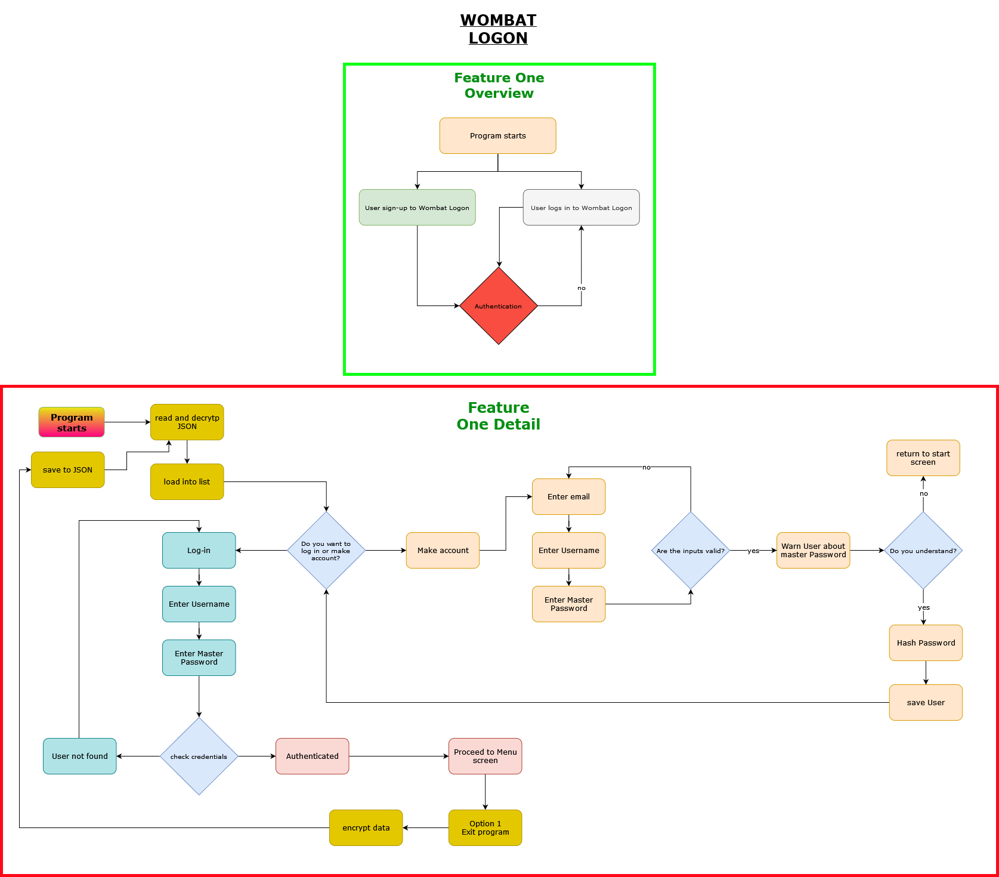
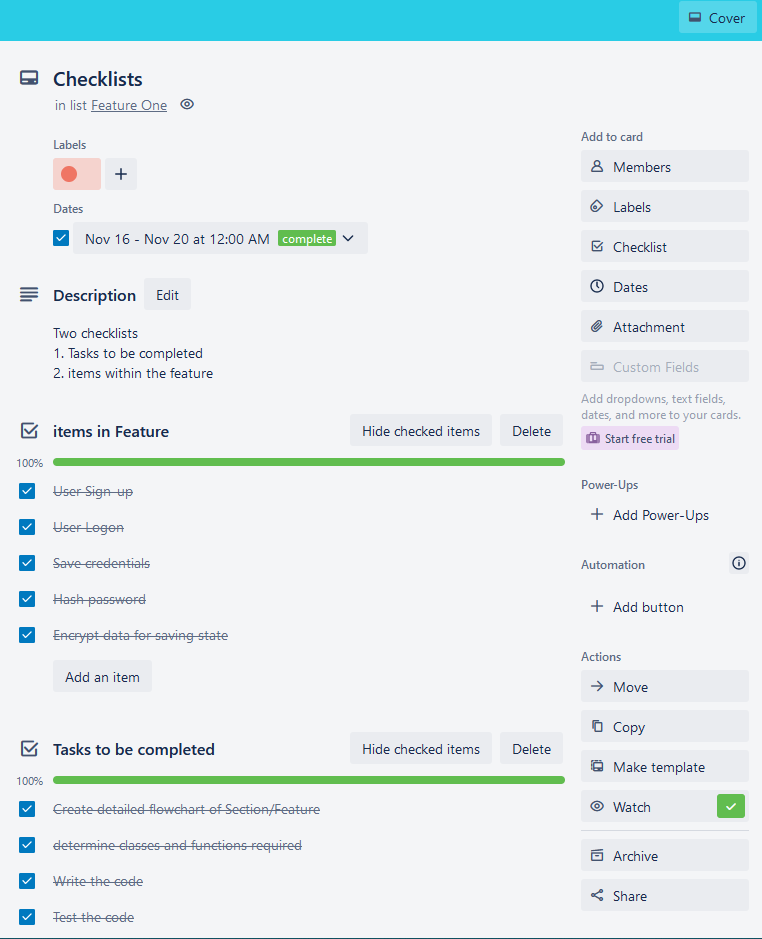
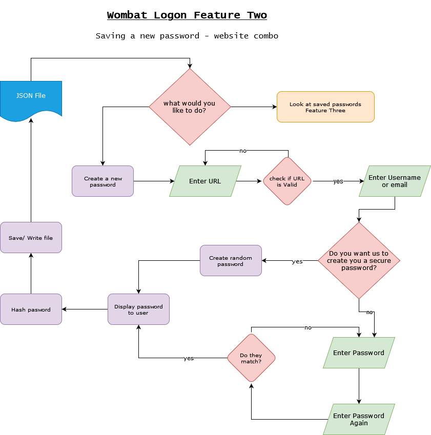
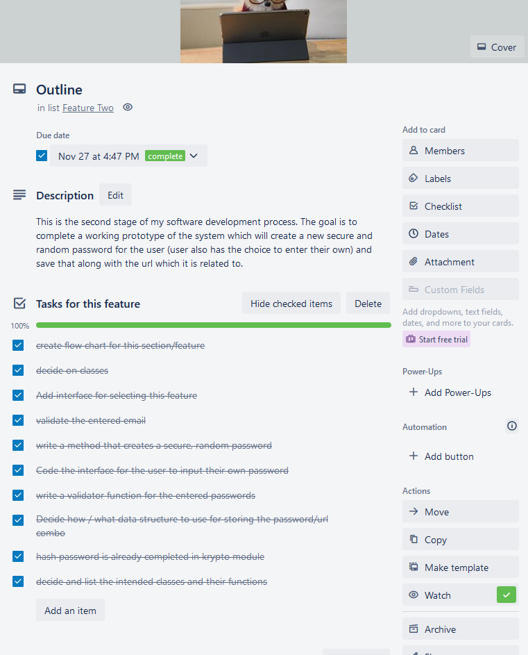
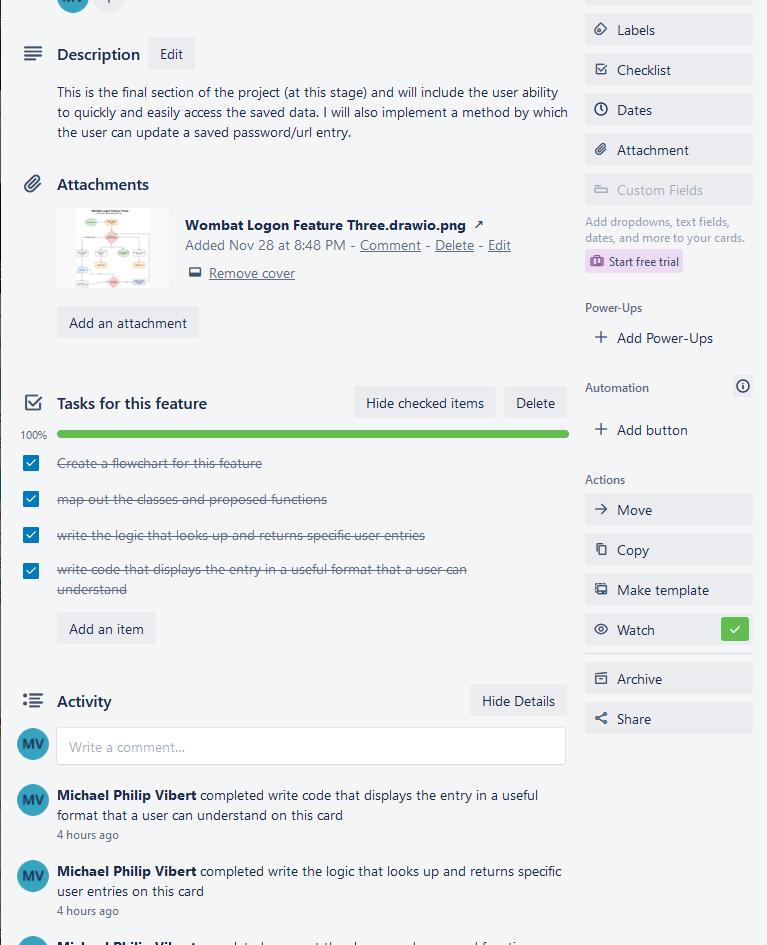

# Wombat Logon
Adding some test text to project
Welcome to Wombat Logon, the only terminal application you will ever need for storing your passwords. Handy, efficient and places the power to remain secure right in your hands.  
_**Please note that this is a practice project and you should NOT trust that this password manager will keep your
passwords safe. Please DO NOT download and use this for real**_

## Source Control
[https://github.com/michael-vibert/wombat-logon](https://github.com/michael-vibert/wombat-logon)
## Python Style Guide
[https://peps.python.org/pep-0008/](https://peps.python.org/pep-0008/)

## 4 Features of Wombat Logon

1. Secure Authentication of the User
2. Strong Password Generator
3. Easy and convenient access to saved login credentials
4. Encryption and Password Hashing

### Description of the features

### 1.
The first feature is my implementation of a system the securely authenticates the User. This means that only the 
owner of the User account and all of the associated credentials will be able to access the account. This will be
implemented using a secure Master Passphrase for the system. It will need to be supplied along with the correct login
details or else access will be denied. I will implement a module called login to handle the authentication process. 
A basic "while True" statement will be ask for input from the keyboard, the input will be assigned to a variable and passed
to a check_username() function which will search the runtime user dictionary and return that user record if found. If the 
username fails to appear in the search the while loop repeats until the user enters the correct username.  
From there a secod while True loop will again ask the user for input (the user password), then using the bcrypt package to 
check if the hash of the entered password matches the hash of the stored value on record. Again the loop continues 
until the password is found. (I will implement maximum number of attempts logic at a future date.)
### 2. 
We all know how challenging it is to come up with good passwords that are strong and at the same time we will remember. 
So my second feature is a dynamic random password generator. Leave the remebering part to Wombat Logon and use our random 
generator to create a strong password. I achieve this via my generate_password module. When you call the method random_pwd(), the
default length is 10 characters. A while loop takes care of the password length while the enmpty string variable pwd is updated with
another character in each pass of the loop. I employ an approach of double randomness with this function. First a random number
in range 0-3 is selected using the randint method of the random package. Then a match case is performed on the selection. Next, 
depending on the number 0-3 a different choice of randomly selected lowercase, uppercase, digit or punctuation character is appended 
to the string. This utilises the secrets package and the choice() method. Secrets is a package that produces cryptographically 
secure pseudo-randomly selected numbers. This number is assigned to the string module which calls the appropriate string constants
methods helping us to select a random character from that set. This is wordy - check out the code and it'll all make sense =)
### 3. 
Having a bunch of secure passwords isn't any good to you unless you can conveniently access them when you need them! So Wombat Logon makes your 
life easy. Just type in your website, and we will return your password in plain text ready to go. Ta da! When it comes to looking up saved 
url passwords, everything is to do with user "entries" as they are known in Wombat Logon (basically dictionary items containing
url, email, password(encrypted) & username(if specified)).  

To query the records on file call the find_user() function. It takes the argument of 
a string which acts as the reference to the user in question. The user will be prompted to input an url and this variable is passed through an if / 
else statement which will call my persistence module and the get_specific_user_entry() method passing the url search term and the username param from
the function call. 

This persistence function opens the user_data.json file, loops through the records using a for loop and if statement to find the 
entered url and returns this record if it is present. If not, it returns None. On a NoneType return the find_entry function loops again 
and if/when the entry is found, my krypto module is called and specifically the decrypt_password function. 

This function takes the stored, encryptped string in bytes format, loads a Fernet key and decrypts the password (returning it). Finally we pass the decrypted password and the data that was returned
from our json search and display it to the console for the user. 

### 4.
There's no point in having all of you most precious secrets all stored in the same place in plain text for any old script kiddy 
to take advantage of. So I will be implementing a system where the password for all of your urls will be stored in an encrypted format. 
We will utilise the Fernet cryptography package which depends on the openSSL project for it's cryptography. When you request to view
your password the data will be found and the password decrypted (as described above). 

There are many many other features within Wombat Logon which you will discover by digging into the 
code and seeing how my novice approach to password management is achieved.
# Implementation Plan
I have a high level overview of the major sections of this project. 
Below you will find a high level flowchart of the various sections/features.
### link to Trello
- link to my [trello board](https://trello.com/b/5ibuUPZm) documenting my project management. 

## Feature One

Flow chart of feature one detailed below:

[More details available on my trello board](https://trello.com/b/5ibuUPZm)

## Feature Two

Flow chart of feature two detailed below:

[More details available on my trello board](https://trello.com/b/5ibuUPZm)

## Feature Three

Flow chart of feature two detailed below:

[More details available on my trello board](https://trello.com/b/5ibuUPZm)

## Help Documentation
To install and run this application please follow these steps:
1. From your terminal ### TO DO

### References
[Link To Reference Sources for this project](docs/references.md)